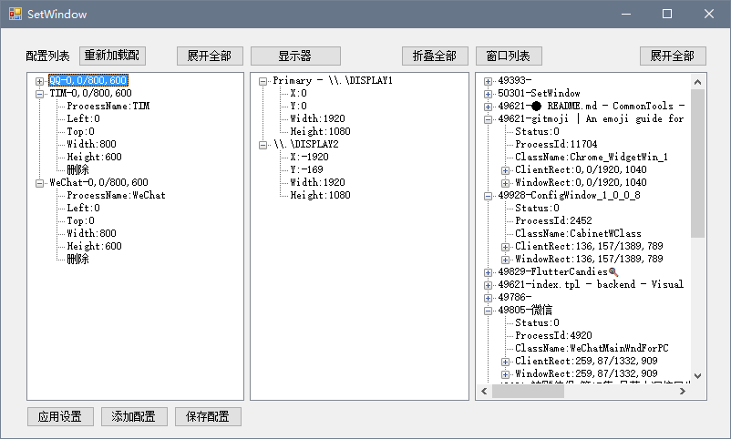

# common-tools
工具软件库


- ✅ SetWindow  窗口定位工具
    - ✅ 添加/修改配置
    - ✅ 列出显示器参数作为配置参考
    - ✅ 列出进程窗口参考
    - ✅ 添加/修改时可直接测试效果
    - ✅ 窗口列表显示进程信息(进程名可用于配置processName)
    - ✅ 窗口列表双击添加配置
    - 🚧 按屏幕定位
    - 🚧 多窗口标题匹配
- ✅ QuickSet  快速应用设置(控制台应用)


## Preview

|SetWindow| |
|:-:|:-:|
|| |

## Usage

启动界面自动应用设置
```bat
@echo off
ConfigWindow.exe --apply
```

不启动界面直接应用设置
```bat
@echo off
ConfigWindow.exe --apply-quit
```
